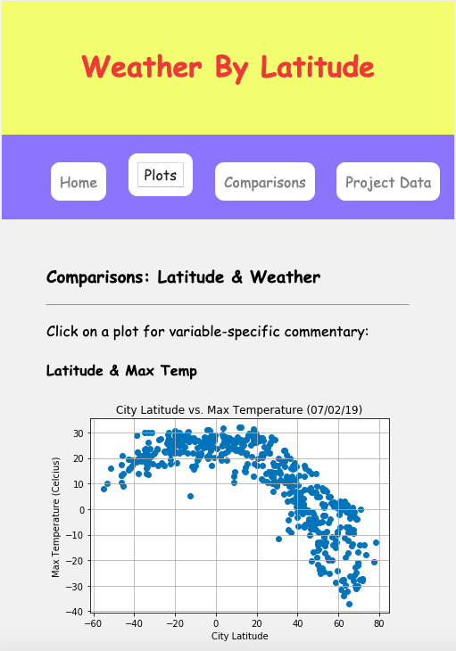

# HTML-Latitude-Weather
This program uses HTML to display the data obtained using the [Python-API-Weather](https://github.com/finnwurtz/Python-API-Weather) program.

Technologies Used: Python, Pandas, Jupyter Notebook, HTML, CSS

In this program, a Jupyter Notebook converts weather data from a CSV to an HTML file, allowing it to be viewed in a web browser using a [local server](https://developer.mozilla.org/en-US/docs/Learn/Common_questions/set_up_a_local_testing_server). The program is designed to organize information about weather patterns into a straightforward and easily navigable website. A webpage is included for each of several wealther variables. Most webpages include graphs that illustrate the relationship between latitude and different weather variables; several webpages include supplemental commentary.

At the top of each of the site's pages, visitors will find a menu whose buttons allow them to navigate the site with ease and efficiency. While the 'plots' drop-down menu directs visitors to pages for several weather indicators, each of which pairs a graph with a short commentary on the indicator, the page linked to the 'comparisons' button displays all of the graphs together and omits the commentary for visual clarity. Meanwhile, the page linked to the 'project data' button gives visitors access to the data used to make the visualizations and the 'home' button brings visitors back to the home page. The Comic Sans typeface was chosen for its demonstrated advantage in facilitating [memory renention](https://www.princeton.edu/news/2010/10/28/font-focus-making-ideas-harder-read-may-make-them-easier-retain). The site is written using a combination of HTML & CSS.

/

